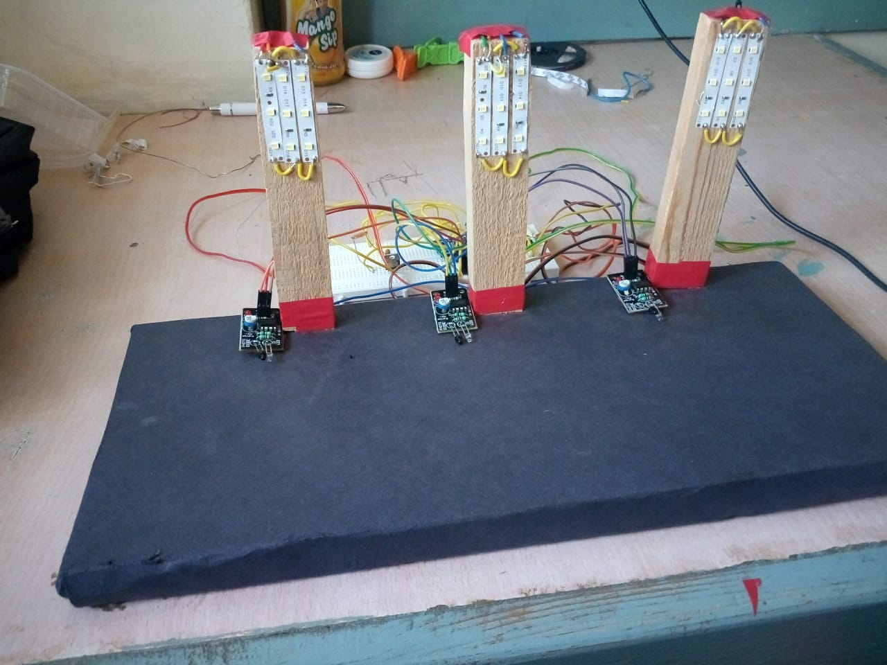

# Smart-Street-Light-System
This project describes implementation of arduino based Smart Street Light System

# Working
The smart street light system controls the intensity of light and automatically operates on detection of light. The street light system depends on the external light source. When its day time the lights are automatically switched off and it operates during night or evening time. On detecting the object on roads, the intensity of the following street lights is increased and  other remain operating at lower intensity, thereby saving power. 
